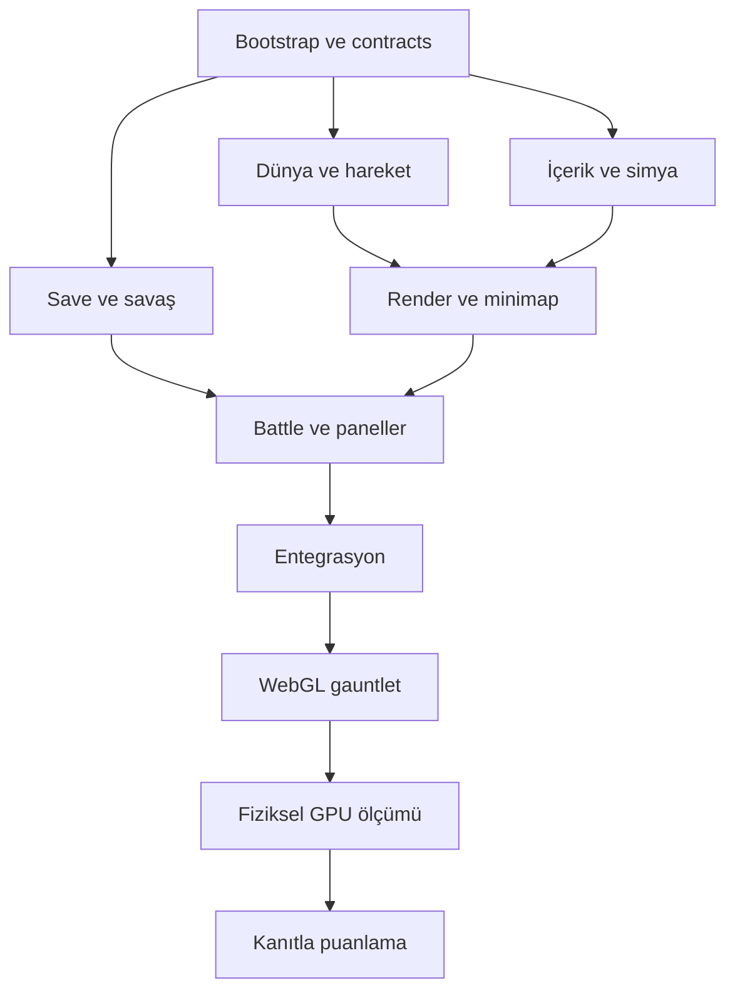
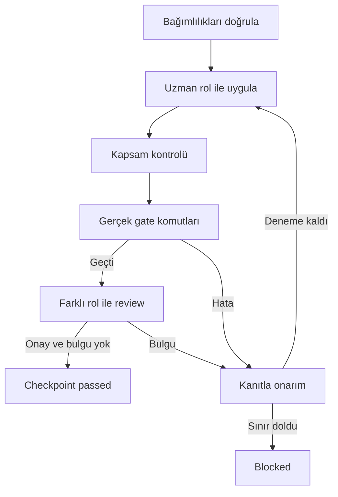

# Mühür Vadisi — oyun geliştirme ve graph loop rehberi

Bu teslim çalışan oyun değil, oyunun nasıl geliştirileceğini belirleyen **çalıştırılabilir otomasyon paketidir**.
Kurucu 36 dosya oluşturur. Kod üretimi ancak `python3 task_engine.py run` ile başlar.

## Oyun kimliği
Üstten ortografik keşif, 8 biyomlu geniş dünya, 16 özgün yaratık, yumurtalar, 33 materyal/ürün,
8 kullanılabilir simya tarifi, 4 slotlu savaş, yakalama, XP ve kayıt sistemi tasarlandı.
Pokémon Gameboy tür hissi ve fantastik arena atmosferi referanstır; karakterler ve isimler özgündür.

## Görev takımı
| Rol | Görev |
|---|---|
| Koordinatör | Ortak sözleşme,save altyapısı,entegrasyon ve graph |
| Dünya | Biyom,chunk,hareket,collision,encounter |
| Render | Three.js,kamera,instancing,GPU kaynakları |
| Savaş | Reducer,yakalama,XP,ödül ve yumurta |
| İçerik | Türler,SVG ön/arka,malzemeler,tarifler |
| Arayüz | Minimap,hedef portresi,battle,grid paneller |
| QA | Negatif test,WebGL,performans,kanıt ve score |

Hazırlık sırasında ana agent ve 6 alt agent çalıştı. Oluşturulan CLI motorunda 7 mantıksal rol vardır,
fakat **tek seferde 1 yazıcı** çalışır; paralel 7 Codex süreci özelliği eklenmemiştir.

## Graph özeti
23 node ve 43 edge. İzinli dosya kapsamı, bağlam ve kabul maddeleri,
atanan agent, farklı reviewer ve gerçek gate komutları her node içinde belirtilir.



| Node | Sahip | İş | Bağımlılık |
|---|---|---|---|
| G00 | coordinator | Vite/TypeScript/Three.js ve test başlangıcı | Başlangıç |
| G01 | coordinator | Ortak tipler, command bus ve oyun durumları | G00 |
| G02 | coordinator | Sürümlü IndexedDB ve transaction ledger | G01 |
| A01 | content | Tür, materyal ve tarif kataloğu | G01 |
| A02 | content | Özgün SVG ön/arka yaratık ve item varlıkları | A01 |
| A03 | content | Atomik simya ve kampta item kullanımı | A01, G02 |
| W01 | world | Bağlı8 biyom ve deterministik terrain | G01, A01 |
| R01 | render | WebGL sahnesi ve takip kamera | G01 |
| W02 | world | Hareket, collision ve erişim | W01, R01 |
| W03 | world | Encounter, keşif ve minimap verisi | W02, A01 |
| C01 | combat | Saf deterministik savaş çekirdeği | G01, A01 |
| C02 | combat | Yakalama, yumurta, XP ve tekil ödül | C01, G02, A03 |
| W04 | world | Chunk state ve kalıcı dünya | W03, G02, C02 |
| R02 | render | Biyom çizimi ve instanced kaynaklar | R01, W04, A02 |
| U01 | ui | HUD, yuvarlak minimap ve büyük hedef kartı | W03, R01, A02 |
| C03 | combat | Dünya-savaş transition adapter | C02, W04 |
| U02 | ui | Battle page ve yakalama arayüzü | U01, C03, A02 |
| U03 | ui | Grid envanter, simya ve kamp panelleri | U02, A03 |
| G03 | coordinator | Bütün modülleri oynanabilir döngüye bağla | U03, R02, C03 |
| C04 | combat | Savaş ve save adversarial regresyon | G03 |
| Q01 | qa | Gerçek WebGL uçtan uca gauntlet | G03, C04 |
| R03 | render | Three.js fiziksel cihaz performansı | Q01, R02 |
| Q02 | qa | Kanıt birleştirme ve100puan release değerlendirmesi | R03 |

# Tasarım ve otomasyon hazırlığı değerlendirmesi: 85/100

Bu puan kendi kontrol listemize göre yapılmış bir hazırlık değerlendirmesidir.
Oyunun eğlencesi, görsel kalitesi veya ölçülmüş performansı için verilmiş bir puan değildir.

| Başlık | Puan | Dayanak |
|---|---:|---|
| İsteklerin görev ve kabul koşullarına çevrilmesi | 20/20 | Hareket, harita, minimap, encounter, battle, capture, XP, simya, save node'ları |
| Domain ve içerik sözleşmeleri | 15/15 | 8 biyom, 16 tür, 33 item, 8 aktif tarif; ortak formül ve ID'ler |
| Node/edge ve rol bütünlüğü | 15/15 | 23 node, 43 edge; döngü kontrolü, 7 rol ve farklı reviewer |
| Çalıştırıcı hata ve durum yönetimi | 20/20 | 20 davranış testi; stale output, gate, scope, checkpoint, timeout kontrolleri |
| Kanıta dayalı score sistemi | 10/10 | 11 test; eksik kanıt, source fingerprint ve hard gate kontrolleri |
| Kurulum ve taşınabilir başlangıç | 5/5 | Üretilen pakette testler geçti; üzerine yazma reddedildi; boş uygulama gate'i başarısız |
| Paralel worktree geliştirme | 0/5 | Runtime tek yazıcı; rol uzmanlaşması var, paralel entegrasyon yok |
| Canlı Codex ve gerçek oyun doğrulaması | 0/10 | Bu ortamda canlı CLI, Three.js gameplay ve fiziksel GPU ölçülmedi |

Oyun skoru: **NOT_MEASURED**. Başarı hedefi >=85/100; ayrıca her kriter >=60 ve tüm hard gate'ler PASS.
Eksik performans veya bozuk save, yüksek diğer puanlarla telafi edilemez.
SVG çizimleri ve uygulama kaynakları graph çalıştırıldığında üretilecek; katalog burada tasarım verisidir.

## Kurulum ve dosya içerikleri

# Mühür Vadisi — Three.js graph/gauntlet paketi

Bu paket 23 node, 43 edge,7 proje skill'i ve gerçek Python task engine içerir.
Henüz çalışan oyun veya SVG'leri üretmez. `run` komutuyla Codex oyun kodunu geliştirmeye başlar.
Kurulum ile kod geliştirme birbirinden ayrıdır. Kurucu boş klasöre dosyaları yazar, Codex çağırmaz.

## Mac üzerinde başlangıç
Python3.9+,Git,Node/npm ve hesabınla giriş yapılmış Codex CLI gerekir. Scriptler macOS/Linux
içindir;Windows için WSL. Bu paket uzak site yayınlamaz veya kişisel skill kurmaz.

İndirilen kurucuyu Downloads altında tut; yeni/boş Desktop/muhur-vadisi klasörünü hedefle:
```bash
python3 ~/Downloads/muhur-vadisi-kurulum.py --dest ~/Desktop/muhur-vadisi
cd ~/Desktop/muhur-vadisi
git init
git add .
git commit -m "Add game graph and gauntlet"
python3 task_engine.py plan
```
Buraya kadar yalnız tasarım/otomasyon dosyaları hazırlandı. Oyun geliştirmesini şimdi başlat:
```bash
python3 task_engine.py run --max-tasks 1 --max-codex-calls 6 --timeout 900
python3 task_engine.py status
```
G00 Vite/Three.js/test altyapısını kurar. Araç/ağ yetkisi yoksa hata giderilmeden tekrar sınırsız deneme yapma.
İlerleyen parti için:
```bash
python3 task_engine.py run --max-tasks 4 --max-codex-calls 24 --timeout 900
```
`--timeout` her alt süreç içindir;toplam süre/para tavanı değildir. Her node3 deneme ile sınırlıdır.
CLI kendi tanımlı Codex modelini kullanır;paket özel model erişimin olduğunu varsaymaz.

## Hata sonrası
`status` çıktısını ve `.loop/NODE/ATTEMPT/` kanıtını oku. Ortam sorununu giderdikten veya
manuel kod değişikliğini inceledikten sonra gerçek başarısız node kimliğiyle:
```bash
python3 task_engine.py reset G00
python3 task_engine.py run --max-tasks 1
```
Reset kaynak silmez;seçili node ve bütün bağımlılarının başarılarını geçersiz kılar.
Emin olmadığın geniş değişiklikte başlangıç node'unu reset et. Graph değiştiyse eski state'i
arşivleyip yeniden başlamak gerekir. Eski başarıyı yeni kaynağa taşımak doğru değildir.
Kilit kaldıysa kaydedilen PID'nin çalışmadığını kontrol etmeden silme.

## Yedi rol nasıl çalışıyor?
coordinator/world/render/combat/content/ui/qa. Her görev atanan rolün talimatıyla yeni Codex
oturumu alır;başka rol read-only review yapar. Motor **sıralı tek yazıcı** kullanır;
yedi paralel terminal/worktree çalıştırmaz. Paket hazırlanırken6 uzman+koordinatör kullanıldı.
İleride paralelleştirme için ayrı worktree,merge conflict gate ve ortak lockfile sahibi gerekir.

## Gauntlet ve skor
Gerçek gate→farklı reviewer→checkpoint. Final oyun skoru için:
```bash
python3 qa/score_current.py --identity
python3 qa/score_current.py
```
İlk komut QA evidence için commit/source kimliği verir. Evidence `.loop/evidence/evidence.json`.
Eksikse puan yok;başarı için85/100,herkriter60ve6hardgatePASS gerekir.
Puan veren dosyaların varlığı sonucu kanıtlamaz;QA gerçek içerik ve test kaynaklarını inceler.

## Paketi test etmek
```bash
python3 engine/test_task_engine.py
python3 -m unittest discover -s qa -p 'test_*.py'
```
Bu testler Python otomasyon/scorer davranışıdır;Three.js oyununun hazır olduğunun kanıtı değildir.
Canlı Codex ve fizikselGPU entegrasyonu bu hazırlıkta çalıştırılmadı.

## Dosyalar
AGENTS.md temel kurallar;SKILLS.md index;.agents/skills altında7 rol;docs/ tasarım;
workflow/graph.json node/edge;task_engine.py giriş;engine/ gerçek motor;qa/ score/test;
design/catalog.seed.json örnek tür ve item verisi.
Noktalı klasörler Finder'da Command+Shift+. ile görünür.
G00 sonrası `npm run dev` geliştirilen uygulamayı açar;kurulumdan hemen sonra npm uygulaması yoktur.

## Kaynaklar
[Codex exec](https://developers.openai.com/codex/noninteractive),
[AGENTS.md](https://developers.openai.com/codex/guides/agents-md),
[Repo skills](https://developers.openai.com/codex/skills),
[OrthographicCamera](https://threejs.org/docs/pages/OrthographicCamera.html),
[InstancedMesh](https://threejs.org/docs/pages/InstancedMesh.html).
Sayısal oyun bütçeleri ve formüller projeye özel tasarım kararıdır.


## `AGENTS.md`

# Mühür Vadisi — proje çalışma sözleşmesi

Amaç: Three.js ile üstten izlenen, geniş biyom haritasında keşif, yaratık/yumurta toplama,
sıra tabanlı savaş, yakalama, XP ve simya içeren özgün bir tek oyunculu tarayıcı oyunu.
Kullanıcı deneyimi Türkçe. Pokémon ve LoL yalnız tür/tür atmosferi referansıdır; karakter,
isim, harita, müzik, arayüz veya görsel kopyalama.

## Otorite ve bağlam
- workflow/graph.json görev sahipliği, bağımlılık ve kabul sözleşmesidir.
- docs/ARCHITECTURE.md ortak modül sınırlarını; docs/DECISIONS.md çelişki çözümlerini belirler.
- WORLD.md/RENDER.md/UI.md/COMBAT.md/CONTENT.md/GAUNTLET.md ilgili görevde okunur.
- SKILLS.md bir index'tir. Gerçek proje skill'leri .agents/skills/*/SKILL.md dosyalarındadır.
- Verilen görevin acceptance ve context alanlarını oku; sonraki düğümün işini gelişigüzel ekleme.
- Merkezi src/contracts/ dışına rakip tip/sözleşme kopyası yazma. Yeni ihtiyaçta mevcut sınırı
  koruyan adapter kullan; görevin scope'u yetmezse somut bağımlılık eksikliğini bildir.

## Ürün değişmezleri
- WASD ve oklar, normalize çapraz hareket, karakter yönü ve yumuşak takip kamera.
- Sol altta dairesel minimap; yakındaki hedef için büyük SVG, ad ve Enter ipucu.
- Yumurta savaşmadan alınır; vahşi yaratıkla Enter savaşı açar; saldırgan önce uyarır.
- Savaşta dost arkadan, rakip önden; dört saldırı slotu, ayrı Yakala ve Kaç.
- Düşük seviyeli yaratığın güçlü slotları kilitlidir; düşük HP olmadan yakalama yapılamaz.
- Toplama, simya, XP, yakalama ve save işlemleri commandId/transaction ile tekilleşir.
- Inventory/Alchemy/Battle açıkken hareket ve dünya aggro'su durur.
- 8 biyom bölgedir; rastgele renkli karelerle geniş harita şartını karşılanmış sayma.

## Uygulama sınırları
Vite + TypeScript + Three.js WebGLRenderer + DOM/SVG UI. Save IndexedDB, tek oyunculu offline-first.
React/backend/auth/multiplayer zorunluluğu yok. Sürümleri G00'da resmi dokümandan doğrula ve sabitle.
World XZ; Y yükseklik. Timestep 1/60; en fazla 5 catchup. Gameplay RNG ve görsel RNG ayrıdır.
SVG bizim ürettiğimiz kod varlıklarıdır; image-generation veya uzaktaki asset URL zorunluluğu yok.

## Gauntlet ve çalışma izni
Yalnız scope yollarında uygulama kodu/test yaz. Engine, graph, AGENTS, skill'ler, QA scorer ve
tasarım sözleşmelerini uygulama görevinde değiştirerek kontrolü gevşetme.
Test skip, boş suite'e başarı, koşulsuz exit0 ve sahte performans raporu yasaktır.
Gate'ler kaynak değiştiremez; raporlar .loop/evidence veya .reports altında tutulur.
Agent kendi işini onaylamaz; farklı rol fresh read-only oturumda inceler.
Reviewer gerçek kod ve raporları okur, yalnız uygulayıcı açıklamasına güvenmez.
Yerel paket kurulumu/derleme yetkili; canlı yayın, uzak hesap değişikliği ve production işlemi bu döngüde yok.
Engine checkpoint'ini agent yazmaz. Gerekli araç/erişim yoksa sonuçta açıkça BLOCKED de.
Global ayar, sandbox veya izin politikalarını genişleterek engeli aşma.
Her rol alt agent başlatmaz. Bu paketin yedi rolünü geçme; runtime yazıcısı bir tanedir.


## `SKILLS.md`

# Proje skill dizini
Bu dosya bir yol haritasıdır; tek başına otomatik skill motoru değildir.
Gerçek instruction dosyaları .agents/skills altındadır ve engine graph.agents rolüne göre yükler.

| Rol | Skill | Temel sahiplik |
|---|---|---|
| coordinator | muhur-coordinator | Ortak contracts, save altyapısı, entegrasyon ve QA review |
| world | muhur-world | Harita, biyom, hareket, chunk ve encounter |
| render | muhur-render | Three.js, kamera, GPU kaynakları ve profil |
| combat | muhur-combat | Savaş state machine, yakalama, XP ve ödül |
| content | muhur-content | Türler, SVG'ler, itemler ve simya |
| ui | muhur-ui | HUD/minimap, savaş, çanta ve simya paneli |
| qa | muhur-qa | Tests, gerçek browser, evidence ve puan |

Toplam7 rol; başka alt agent yok. Her node'un agent ve farklı review_agent alanı vardır.
Skill'ler bu projeye aittir; kişisel ChatGPT skill kurulumunu değiştirmez.


## `docs/BRIEF.md`

# Oyun kapsamı
Oyuncu karakteri üstten görünümde haritada dört yöne hareket eder ve kamera takip eder.
Geniş dünya çim, yoğun orman, çöl, deniz, beyaz buzul, kahverengi kanyon, lacivert volkan
ve alev bölgelerine ayrılır. Sol alt dairesel minimap coğrafyayı, karakteri ve yakın hedefleri gösterir.
Yaratık/yumurta yaklaşınca büyük özgün SVG portre ve isim görünür. Enter hedef etkileşimini açar.
Yumurta alınır; yaratıkla savaş ekranına geçilir. Bazı saldırganlar oyuncuya meydan okur.
Savaşta dost sırtı dönük, rakip önden; dört saldırı slotu ve zayıflayan rakibi yakalama.
Başlangıç zayıf yaratıklar/yumurtalarla öğreticidir. Zafer ve yakalama XP sağlar; seviye ve
kozmetik evrim açılır. Düşman zaferleri materyal ve sır parçaları verir.
Çeşitli simya malzemeleri, grid çanta ve tarif penceresi stratejik hazırlık sağlar.
Bu teslim bu oyunu üretecek geliştirme paketi ve tasarımdır; oyun kodu henüz üretilmedi.


## `docs/ARCHITECTURE.md`

# Katmanlar ve veri akışı

| Modül | Sorumluluk | Yasak bağımlılık |
|---|---|---|
| src/contracts | VecXZ, input, world/battle event, save port, item/tür kimlikleri | Three.js veya DOM import |
| src/world | seed terrain, collision, movement, discovery, encounter | UI panelini doğrudan açmak |
| src/render | Three.js scene/camera/chunks/resources | mesh konumunu authoritative gameplay state saymak |
| src/game/combat | saf battle reducer, RNG ve komutlar | animasyon callback'inden ödül vermek |
| src/game/save | IndexedDB transaction, version, ledger, migrations | partial overwrite/sessiz reset |
| src/content | katalog, tarif, toplama/üretim ve camp use | ayrı savaş formülü |
| src/ui | HUD, SVG, battle/inventory/alchemy DOM | doğrudan HP veya inventory değiştirmek |
| src/app | yaşam döngüsü, event routing, input ownership | diğer katmanların iş kuralını çoğaltmak |

Boot → LoadSave → Exploring ↔ Panel → EncounterIntro → Battle → CommitOutcome → Exploring.
Commit başarısızsa Recovery durumunda kal; dünya kilidi açılmaz, aynı transaction tekrar denenir.
Oyun tek bir command bus ile eylem alır. UI intent gönderir, domain event üretir, adapter save eder,
renderer snapshot tüketir. Böylece aynı seed ve komut kaydı baştan oynatılabilir.

## Ortak sözleşme taslakları
```ts
type GameMode = 'boot'|'exploring'|'panel'|'encounter'|'battle'|'committing'|'recovery';
type BiomeId = 'meadow'|'forest'|'earth'|'desert'|'sea'|'ice'|'volcanic'|'flame';
interface VecXZ { x: number; z: number }
interface NearbyTarget {
  entityId: string; kind: 'egg'|'creature'|'resource'; name: string;
  spriteId: string; distance: number; level: number; interactionAllowed: boolean;
}
interface GameCommand { commandId: string; tick: number; type: string; payload: unknown }
interface SavePort {
  load(): Promise<unknown>;
  transact(commandId: string, mutate: (draft: unknown) => void): Promise<unknown>;
}
```
Bunlar uygulama kodu değil, G01'in ayrıntılı discriminated-union ve şema ile somutlaştıracağı sınırlardır.
SavePort transaction callback'inde ağ veya await yapılmaz; IndexedDB transaction aktifliği korunur.
Kullanıcı girdisi transaction commit olduktan sonra görsel event'e çevrilir; commandId tekrarında
önceki sonuç dönülür. Yazma hatasında komple önceki durum geri yüklenir.

## Save şeması
version, generatorVersion, seed, rngStreams, playerPosition, discoveredCells, consumedEntityIds,
creatureInstances, activeCreatureId, inventory, deliveryBox, eggs, secretFlags, battleState,
rewardLedger ve appliedCommands birlikte sürümlenir. IndexedDB single transaction store sınırı
gerçek browser testinde doğrulanır. Kota/bozuk save için export/retry; otomatik veri silme yok.
Offline süre kuluçka ilerletmez. Sekme gizliyken simülasyon durur.

## Test katmanları
Vitest: saf domain/seed/mapping/formüller. Fake IndexedDB yardımcı test + gerçek browser transaction testi.
Playwright: WebGL görünüm, klavye ve panel/savaş yolları. Fiziksel cihaz: performans rotası.
Test runner boş test kümesini fail eder. Setup testleri gelecekteki oyun testlerinin yerine geçmez.


## `docs/DECISIONS.md`

# Kararlar ve çelişki çözümü

| ID | Kabul edilen karar |
|---|---|
| D01 | Proje adı Mühür Vadisi; seed `wildseal-01` teknik kararlı kimliktir. |
| D02 | 2048m kare XZ dünya, 64m chunk, 2m hücre; 8 makro biyom. |
| D03 | 5×5 aktif görsel (25), 3×3 simülasyon (9); en fazla 24 ek cache ile resident üst sınırı49. |
| D04 | Sabit1/60s, max5 substep, frame delta en fazla5/60s. |
| D05 | Minimap kuzey yukarı,192 px (dar ekranda144),96m yarıçap; büyük portre UI'de. |
| D06 | Kamp40m aggro güvenli; kamp yaratıkları1–2, çayırın dış kısmı1–3. |
| D07 | Genel dönüş koruması3s; kaçılan aynı encounter8s, yenilgide aynı düşman30s cooldown. |
| D08 | Yakalama formülü/XP/RNG için COMBAT.md otoritedir; content combat formülü eklemez. |
| D09 | 4 slot görünür; güçlü slotlar seviyeye bağlı kilitli. Siper savunma eylemidir. |
| D10 | Biome IDs: meadow,forest,earth,desert,sea,ice,volcanic,flame; Türkçe ad yalnız gösterim. |
| D11 | Isı Otu=`heat_herb`, Mühür=`seal`. Tam8 simya tarifi MVP; kamp-only etkiler CONTENT.md. |
| D12 | Denizde başlangıçta kıyı erişimi var; derin su geçilmez. Yüzme/multiplayer/gerçek zamanlı MOBA combat yok. |
| D13 | UI savaşı U02'nin işi; combat rolü reducer/transition adapter üretir, aynı paneli iki rol yazmaz. |
| D14 | Referans hedef M1 8GB1440×900,DPR<=1.5,3×120s, p95<=20ms,p99<=33.4ms,draw<=150,tri<=300k. |
| D15 | Başka donanım raporu ayrı sonuçtur. Referans koşulu ölçülmeden performance gate pass olmaz. |
| D16 | Paket7 rol içerir; CLI motoru rolleri sırayla çalıştırır. Eşzamanlı worktree scheduler dahil değil. |

Biyom şifreleri ve sır parçaları keşif ödülleridir. P1: suda hareket, hava olayları, ilave evrim
ağaçları; temel8 biyom/16 tür/8 tarif bunları beklemeden tamamlanır.
Uzman belgeleri arasında ölçü veya ad farkı kalırsa bu karar tablosunu uygula ve farkı raporla.


## `docs/WORLD.md`

# Dünya sözleşmesi — Mühür Vadisi

Bu belge uygulama hedefidir; aşağıdaki kabul koşulları çalıştırılmadan özellikler tamamlandı sayılmaz. Dünya agent'ı dünya verisi, hareket ve karşılaşma seçiminden sorumludur; çizim render agent'ına, panel ve etkileşim UI agent'ına aittir.

## Koordinatlar ve deterministik üretim

- Oynanabilir alan: 2.048 × 2.048 metre; düzlem XZ, Y yükseklik; merkez (0,0). Seed, generatorVersion ve saveVersion kayıt altında tutulur. İlk sürüm seed `wildseal-01`.
- Chunk: 64 × 64 metre; toplam 32 × 32 chunk. Hücre: 2 metre. Görsel chunk yükleme çevresi ve simulation çevresi ayrıdır: oyuncunun bulunduğu chunk etrafında görsel 5×5, etkin simulation 3×3. Kenarlarda alan kırpılır.
- Rastgelelik, global sıralı random çağrısına bağlı değildir: `hash(seed, subsystem, chunkX, chunkZ, entityIndex)`. Chunk yükleme sırası dünyayı değiştirmez. Savaş RNG ayrı akıştır.
- Terrain verisi: height, biomeId, traversable, hazard, regionId. Entity kimlikleri seed+chunk+index ile kararlıdır. Toplanan item ve yakalanan yaratık tombstone kaydıyla yeniden doğmaz; respawn ayrıca oyun zamanı ile yönetilir.

## Birbirine bağlı biyomlar

Renk tek başına bilgi taşımaz: her biyom farklı siluet, zemin deseni, isim ve minimap simgesi taşır. Yaklaşık kara/su hedefleri aşağıdadır; oranlar üretim hedefidir, her seed için yüzdeye zorlanan doğrulama değildir.

| Bölge | Pay | Görünüm | Oyun rolü |
|---|---:|---|---|
| Şafak Çayırı | %22 | Açık yeşil, kısa çimen, çiçek kümeleri | Güvenli başlangıç, yumurtalar, seviye 1–3 |
| Fısıltı Ormanı | %18 | Koyu yeşil, yoğun ağaç kümeleri | Otlar, gizli yollar, seviye 3–8 |
| Kehribar Çölü | %13 | Altın kum, dalga dokusu | Mineraller, gündüz tehlikesi, seviye 6–12 |
| Mercan Kıyısı / Deniz | %15 | Turkuaz kıyı, mavi derin su | Kıyı itemleri; derin su ilk sürümde kapalı |
| Akbuz Yaylası | %10 | Beyaz/mavi, çatlak buz ve kristaller | Buz yaratıkları, seviye 10–18 |
| Paslı Kanyon | %10 | Kahverengi katmanlar, kuru kayalar | Simya cevheri, seviye 8–16 |
| Gecebazalt | %8 | Lacivert/siyah bazalt, mor damarlar | Nadir kaynaklar, seviye 15–23 |
| Kor Çanağı | %4 | Kırmızı/turuncu lav, duman | Son bölge; ateş lekeleri, seviye 20–30 |

Biyomlar hücre başına bağımsız rastgele renkler değildir: sabit makro bölge merkezleri, düşük frekanslı sınır sapması ve nem/sıcaklık alanları kullanılır. Çöl kıyıya, buz kuzey yükseltisine, lav bazaltın içine yerleşir. Bölge sınırlarında 12–24 m geçiş şeridi bulunur. Tasarlanmış ana yollar ve köprüler üretimden sonra carve edilir. Başlangıç kampından bütün kara bölgesi girişlerine yürünebilir yol flood-fill ile kanıtlanır. Deniz adaları ilk sürümde dekor veya köprüyle bağlıdır; ulaşılamaz adaya görev hedefi konmaz.

## Hareket ve takip kamera sözleşmesi

WASD / yön tuşları kamera düzleminde hareket eder. Çapraz vektör normalize edilir; tuş sayısı hızı artırmaz. Oyun simulation'ı sabit 1/60 sn adımla ilerler; frame birikimi en fazla 5 adıma kırpılır. Sekme geri geldiğinde teleport oluşmaz. Dünya sınırı, ağaç gövdesi, kaya ve derin su karakter kapsülü/daire yaklaşımı ile engellenir; duvar boyunca kayma desteklenir. Kamera yüksekten eğimli ortografik görünüm kullanır; hedef konum oyuncu+bakış ötelemesidir. Takip yumuşatma frame hızından bağımsız exponential damping kullanır. Savaş, panel odaklı metin girişi ve pause durumunda dünya hareketi kapalıdır. Simülasyon kamera koordinatlarına bağlı değildir.

## Yakınlık ve karşılaşma

Spatial hash en yakın chunk komşularını sorgular; her frame tüm dünya yaratıkları taranmaz. Görünür yakınlık 24 m, etkileşim 6 m, düşman aggro 10 m. Uzaklaşma eşiği etkileşim için 8 m (histerezis). Seçim: erişilebilir etkileşim hedefi, ardından mesafe, ardından kararlı entityId. Engel arkasındaki hedefle savaş başlatılmaz. Tek bir `nearbyTarget` olayı UI'ya gider; payload entityId, kind, name, spriteId, distance, level, interactionAllowed alanlarını taşır. UI büyük SVG portresini, ismini ve Enter ipucunu gösterir; minimap aynı hedefi vurgular.

Yumurta doğrudan toplama paneli açar; vahşi yaratık Enter ile savaşa geçer. Saldırgan yaratık önce 1,2 sn uyarı verir, güvenli başlangıç yarıçapında aggro oluşturmaz. Tek karşılaşma kilidi aynı anda iki savaş açılmasını önler. Savaş dönüşünde 3 sn aggro bağışıklığı vardır. Kaçış oyuncuyu son güvenli konuma getirir. Yakalanan/yenilen hedef dünya state'inden atomik kaldırılır; save işlemi aynı sonuca iki kez ödül veremez.

## Dairesel minimap

Sol alt köşede kuzey-yukarı, dairesel 192 CSS px harita (dar ekranda 144 px). Arazi düşük çözünürlüklü atlas olarak chunk değişiminde güncellenir; işaretçiler en fazla 10 Hz güncellenir. Oyuncu merkezde yön oku; 96 m görüş yarıçapı; yalnız keşfedilmiş alan ve algılama yarıçapındaki yaratık/yumurta görünür. Daire dışı işaretçiler kırpılır. Konum dönüşümü x ekran-sağ, z ekran-aşağı sözleşmesini kullanır ve birim testlidir. İkonlar yumurta, sakin yaratık, saldırgan yaratık ve kaynak için biçimle ayrılır. UI agent'ı çerçeve/tooltip'i; render agent'ı atlas üretimini; dünya agent'ı keşif ve işaretçi verisini sağlar.

## Performans ve kanıt

60 FPS masaüstü hedefi, mobilde 30 FPS hedefi ölçüm olmadan başarı sayılmaz. Render agent'ıyla paylaşılan hedefler: etkin sahne draw calls ≤150, görünür triangles ≤300k, 120 sn sabit rota sonunda GPU kaynak sayılarında sürekli büyüme yok. Bunlar başlangıç bütçeleridir; ölçülen cihaz, viewport ve DPR raporlanır. Dünya query p95 ≤2 ms ve simulation p95 ≤4 ms hedefi aynı kayıtlı rotada ölçülür. CI headless CPU süreleri GPU/FPS kanıtı yerine geçmez.

Zorunlu testler: 20 sabit seed için başlangıç güvenliği, bütün zorunlu bölge girişlerinin bağlılığı, seed tekrar üretimi, chunk sırası bağımsızlığı, sınır çarpışması, çapraz hız, pause/sekme geri dönüşü, hedef seçim histerezisi, çift encounter kilidi, yakalanan yaratığın reload sonrası kaybolması, minimap dört yön ve clipping doğruluğu. Her gate exit code ve makine okunur rapor üretir; henüz yazılmamış test başarı değildir.


## `docs/RENDER.md`

# Three.js görüntüleme sözleşmesi

Bu belge uygulama hedefidir; hiçbir FPS veya GPU bütçesi ölçülmüş sonuç olarak sunulmaz. Three.js sürümü bootstrap sırasında tam sürüm olarak package.json ve lockfile içinde sabitlenir. Uygulama TypeScript, Vite ve WebGLRenderer ile başlar; WebGPU zorunluluğu yoktur.

## Koordinat ve sorumluluk

Dünya zemini XZ, yükseklik Y; kuzey -Z, doğu +X. Oyun mantığı metre ve saniye kullanır. Harita, çarpışma ve karşılaşma sorguları saf simülasyona aittir; renderer yalnızca salt okunur snapshot tüketir. Mesh konumu oyun durumunun kaynağı değildir. Her entity kalıcı ID taşır. Aynı ID chunk boşaltıldığında kaybolmaz.

```ts
interface VecXZ { x: number; z: number }
interface RenderEntity { id: string; position: VecXZ; height: number; yaw: number; visualId: string }
interface WorldFrame { tick: number; playerId: string; entities: readonly RenderEntity[]; visibleChunkIds: readonly string[] }
interface RendererPort {
  mount(host: HTMLElement): void;
  render(previous: WorldFrame, current: WorldFrame, alpha: number, realDelta: number): void;
  resize(width: number, height: number): void;
  dispose(): void;
}
```

Bu tipler entegratörün merkezi contracts modülünden içe aktarılır; rol kendi kopyasını üretmez. Birim hareket WASD/ok tuşlarıdır. Çapraz giriş normalize edilir. Son sıfır olmayan hareket yaw yönünü belirler. Key repeat hareketi hızlandırmaz; pencere blur durumunda giriş temizlenir.

## Kamera ve zaman

OrthographicCamera, takip edilen karakterin üstünde 60 derece eğimli sabit kuzey yönelimli açı kullanır. Ekranın dikey dünya kapsamı başlangıçta 32 birimdir; yatay kapsam en/boy oranından türetilir. Resize sonrası projection matrix güncellenir. Oyuncu dönüşü kamerayı döndürmez. Kamera hedefi player konumudur; yumuşatma katsayısı `1 - exp(-10 * realDelta)` ile FPS bağımsız hesaplanır. Teleport ve yükleme durumlarında kamera hedefe sıfırlanır. Kamera sınırlarında harita dışı boşluk gösterilecekse sis/okyanus zeminiyle kapatılır.

Simülasyon 60 Hz sabit adım kullanır. Her karede gelen delta en fazla 5/60 s, en fazla 5 simülasyon adımıdır; aşan birikim atılır ve telemetry sayacı artar. Render previous/current snapshot arasında interpolation yapar. Gizli sekmeden dönüşte zaman birikimi sıfırlanır; karakter ileri fırlamaz. Battle ve modal durumunda dünyadaki hareket/aggro durur; UI animasyonu çalışabilir. Mantık RNG ile görsel parçacık RNG ayrı kaynaklardır.

## Chunk yaşam döngüsü

Chunk boyutu dünya rolünün ortak sabitinden gelir. Kamera frustum kapsamındaki chunk'lar ve bir güvenlik halkası yüklenir; aktif görsel pencere 5x5 (25) chunk, simülasyon penceresi 3x3; en fazla 24 ek cache chunk ile unload hysteresis dahil en çok 49 resident chunk. Uzaklaştırma için ekstra bir halka hysteresis kullanılır; aynı sınırda gezinme thrash üretmez. Worker sonuçları generation token taşır: artık gerekli olmayan asenkron sonuçlar sahneye eklenmez.

Ağaç, çalı ve taşlar tür/malzeme/chunk bazında InstancedMesh olarak gruplanır. Her ağaç için ayrı mesh, materyal ve texture yasaktır. Instance transform değişince instanceMatrix güncellenir; bounds yeniden hesaplanır. Hasat sonrası instance-ID eşlemesi bozulmaz. Arazi düşük poligon chunk mesh, kıyı ve biyom geçişleri vertex color veya az sayıda paylaşılan materyaldir. SVG yaratıklar atlas/sprite ya da düşük poligon yardımcı gövdelerle dünyada görünür; büyük SVG portre UI tarafındadır.

Kaynak kayıtçısı geometri, materyal, texture ve render target sahipliğini izler. Chunk'a özel kaynak unload'da dispose edilir; paylaşılan kaynak referans sayısı sıfıra düşünce serbest bırakılır. Scene.remove GPU serbest bırakma kabulü değildir. Olay dinleyicileri, animation loop ve canvas da son dispose'da kaldırılır. Context kaybında anlaşılır yeniden yükleme arayüzü gösterilir; boş siyah ekran kabul edilmez.

## Bütçe ve doğrulama

Referans profil: fiziksel Apple Silicon M1 8 GB Mac, 1440x900 CSS piksel, DPR üst sınırı 1.5, güç adaptörü, görünür sekme, tarayıcı ve işletim sistemi sürümü kaydedilmiş. Bu cihaz yoksa sonuç pending olur; yazılım WebGL çıktısı fiziksel GPU ölçümü yerine geçmez.

- Isınma 10 s, sabit seed rota 120 s: yoğun orman, su kıyısı ve volkan dahil. p95 frame interval <= 20 ms, p99 <= 33.4 ms hedef.
- En fazla 150 draw call ve 300 bin görünür üçgen/kare; renderer.info snapshot ile ölç. Gölge tek directional light; düşük profilde blob shadow kullan.
- Tahmini texture+render-target ayrılmış bellek <=128 MiB. Bu hesaplanan bütçedir; renderer.info toplam VRAM baytı değildir. Gerçek VRAM ölçüldü denmez.
- Aynı 20 chunk giriş/çıkış döngüsü sonrası resident <=49; cache ısındıktan sonra geometry/texture sayıları son beş turda monoton artmamalı; kaynak sahiplik kaydı sonunda boş olmalı.
- 30/60/120 render FPS altında 10 saniyelik aynı giriş replay'i simülasyon sonunda aynı koordinata ulaşmalı; kamera durduktan 0.5 s sonra hedef sapması <=0.1 dünya birimi.
- 1280x720 ve 1920x1080 ekran görüntüsü: karakter görünür, biyom sınırları okunur, HUD kesilmez. Hiçbir pass yalnızca ekran görüntüsüne bakılarak performans puanı kazanmaz.

Kanıt JSON: commit, seed, route, browser, hardware, resolution, dpr, warmupSeconds, sampleSeconds, samples, p95Ms, p99Ms, maxDrawCalls, maxTriangles, residentChunks, resourceCounts. Eksik ölçüm `not_run`; başarılı varsayılmaz.

Kaynak: [Three.js resmi API kataloğu](https://threejs.org/docs/). Buradaki koordinatlar, eşikler ve bütçeler projeye özgü tasarım kararlarıdır.


## `docs/UI.md`

# Arayüz ve etkileşim sözleşmesi

Dil Türkçe; özgün fantastik arayüz. Koyu mürekkep paneller, kemik beyazı metin, pirinç vurgu. Biyom renkleri world kataloğundan alınır. Pokémon veya LoL logoları, isimleri ve görselleri kullanılmaz. SVG'ler projede üretilen özgün varlıklardır; front/back ayrı çizimlerdir. Arkadan görünüş yalnızca önden görseli yatay çevirmek değildir.

## Durum ve komut sınırı

UI snapshot okur, command gönderir; HP, item, XP ve yakalama sonucunu kendisi değiştirmez. Durumlar: loading, explore, encounter, battle, reward, defeat, paused. Inventory/alchemy/bestiary modal state'i explore altında tutulur. Bir modal açıkken dünya hareketi ve aggro askıdadır. UI komutu `{id, type, payload}` içerir; command id tekrarları domain katmanında reddedilir. Battle animasyonu sonucu belirlemez.

## Keşif ekranı

Sol alt köşede 192 px çapında dairesel minimap, 16 px güvenli kenar boşluğu. 1280x720 altında 144 px. Canvas2D veya SVG mask ile gerçek dairesel clipping; ikinci Three.js dünya render'ı gerekmez. Kuzey üsttedir, oyuncu merkezde, görüş alanı daire yarıçapına karşılık gelen 96 metre dünya mesafesidir. `dx=x-player.x`, `dy=z-player.z`; `screenX=centerX+dx*scale`, `screenY=centerY+dy*scale`. Uzak işaretler daire dışına taşmaz. Kuzey oku ve biyom adı bulunur. Statik arazi atlası chunk değişiminde, dinamik marker katmanı en az 10 Hz yenilenir. Fog-of-war keşif kaydından okunur; keşfedilmemiş yaratıklar gösterilmez.

Marker: oyuncu üçgen, yumurta oval, yaratık pençe, saldırgan yaratık kırmızı konturlu pençe, simya itemi elmas, keşfedilmiş sır yıldız. Renk tek bilgi taşıyıcısı değildir. Tek minimap işareti DOM tab sırasını doldurmaz; seçili hedef adı metin olarak okunur.

24 metre algılama alanında hedef işaretlenir; 6 metre etkileşim alanında ve görüş hattındaki en yakın hedef, domain target seçicisinden gelir. Bağlı mesafede kararlı ID ile seçim; bir hedef diğerinden belirgin yakın olmadıkça kart titreşerek değişmez. Alt orta encounter kartında en az 128x128 SVG, isim, seviye, element, davranış ve `Enter: İncele / Savaş` bulunur. Yumurta için `Enter: Topla`, çanta doluysa gerekçeli disabled durum. Toplama ve yakalama ayrı kavramlar. Yaratık yakalama savaş içindedir. Saldırgan yaklaşım domain olayıyla savaş başlatır; kısa görünür uyarı, sonrasında yeniden tetiklenmeyi önleyen cooldown gerekir.

## Battle page

Keşif ekranının üzerinde tam battle sahnesi. Sol altta oyuncunun yaratığının sırt SVG'si; sağ üstte düşmanın ön SVG'si. Her iki tarafta isim, seviye, HP sayısı+bar, element ve durum etkisi. Oyuncu XP barı görünür. Biyom battle arkaplanını belirler ama okunurluk korunur.

Alt bölümde 2x2 düzende tam dört saldırı butonu. Her birinde ad, element, güç, isabet, kalan kullanım/bedel. Düşük seviyede kilitli hareket aynı yerde kalır ve açılma seviyesi yazılır; dört güçlü saldırı verilmez. Ayrı `Yakala`, `Çanta`, `Kaç` kontrolleri. Yakala stok ve hedef uygunluğunu gösterir; zayıflayınca oran yükselir, kesin başarı iddia edilmez. Sonuç domain RNG'sinden gelir. Bayılmış hedef yakalanamaz.

Oyuncu kararı dışındaki resolving/animating/enemyTurn/result durumlarında bütün eylemler kilitlenir. Çift tık tek tur tüketir. Yakalama başarısızlığı domain kurallarına göre karşı tura geçer. Kazanç penceresinde yalnızca domain reward ledger içindeki item/XP/sır gösterilir. Kapatıp yeniden açma ikinci ödül vermez. Yenilgi sonrası güvenli başlangıç noktasına dönüş ve takımın toparlanması açıkça anlatılır.

## Strateji panelleri

`I` envanter, `C` simya, `B` yaratık defteri; Escape üstteki paneli kapatır ve odağı eski düğmeye döndürür. Envanter 6 sütun grid, ikon, adet, kalite/element ve seçili item açıklaması. Klavye okları hücreyi gezer; Enter seçer. Dokunmatik sürükleme zorunlu değildir. Sıralama/filtreler inventory verisini değiştirmez. Takım değiştirme battle içinde ancak izin verilen command ile gerçekleşir.

Simya paneli sol tarif listesi, orta 3 malzeme yuvası, sağ sonuç/olasılık ve üret butonu. Katalogda iki girdili tarif varsa üçüncü boş yuva zorunlu kılınmaz. Stok eksiği miktarla yazılır; atomic craft komutu tüm girdileri ve alan yeterliliğini birlikte doğrular. Butona çift basmak eksi stok üretemez. Keşfedilmemiş tarif isimleri/sırları spoiler olarak gösterilmez. Yumurtalar kuluçka sekmesinde mesafe/XP gereksinimi ile takip edilir.

## Kabul kanıtı

- 1280x720 ve 1920x1080 screenshot seti: çayır keşfi, seçili yumurta, saldırgan encounter, battle, başarısız/başarılı yakalama, envanter dolu, simya eksik stok, ödül.
- Minimap koordinat testi dört kardinal yön, çapraz, yarıçap sınırı; piksellerde <=1 px dönüşüm hatası; görünmeyen hedef gösterilmez.
- Gerçek tarayıcı akışı: hareket → kart → Enter → battle → saldırı → Yakala → takım güncelleme → dünya dönüşü. UI testleri domain API'sini mock ederek tek başına end-to-end kabul edilmez.
- Enter basılı tutulunca tek encounter; modalda hareket yok; battle çift tık tek command; aynı reward iki kez alınamıyor.
- Klavye ile tüm eylemler erişilir; görünür focus, dialog adı, focus trap ve Escape dönüşü vardır. Metin kontrastı normal yazıda en az 4.5:1; aksiyon hedefi en az 44x44 CSS px.
- Hareket azaltma tercihi kamera sarsıntısını/flash'i kapatır. Ses kullanıcı etkileşimi sonrası başlar, ayrı sessize alma kontrolü bulunur.

Testlerin her biri pass/fail/not_run olarak kaydedilir. Görsellerin hazırlanmış olması uygulama akışının çalıştığı anlamına gelmez.


## `docs/COMBAT.md`

# Mühür Vadisi — Savaş, yakalama ve ilerleme sözleşmesi

Bu belge uygulama hedefidir; uygulanmış veya test edilmiş özellik iddiası değildir. TypeScript saf çekirdek Three.js ve DOM'dan bağımsızdır. Grafik animasyonları yalnızca çekirdeğin ürettiği olayları gösterir.

## Model ve görünüm

`BattleState`: version, battleId, encounterId, phase, turn, rngState, playerCreatureId, enemy, playerHp, enemyHp, stamina, enemyStamina, status, inventorySnapshot, committedActions, outcome. Fazlar: `INTRO`, `PLAYER_INPUT`, `RESOLVE_PLAYER`, `RESOLVE_ENEMY`, `TURN_END`, `WON`, `CAPTURED`, `LOST`, `FLED`. Terminal fazlardan işlem alınmaz. Savaşta tek aktif dost ve tek rakip bulunur; takım değiştirme ilk sürüm dışındadır.

Ekranda kendi yaratığımız sol altta sırt silüetiyle; rakip sağ üstte ön görünümle yer alır. İki SVG aynı türün aynı renk, boynuz, kanat ve kuyruk özelliklerini korur. Üstte ad, seviye, HP; altta dört saldırı, ayrı Yakala ve Kaç düğmesi, kısa olay günlüğü bulunur. Animasyon sırasındaki düğmeler kilitlenir. Hareket ve dünya etkileşim girdileri savaş açıkken tüketilmez. Klavye 1–4 saldırı, C yakala, Escape kaç; Enter yalnızca dünya karşılaşma panelini açar, saldırıyı tetiklemez.

## Deterministik çözüm

Bütün zarlar sürümlenmiş xorshift32 PRNG ile çekirdek içinde üretilir. Sıfır seed `0x6d2b79f5` olur. Her adımda unsigned 32-bit olarak `x ^= x << 13; x ^= x >>> 17; x ^= x << 5`; `u=(x>>>0)/4294967296`. Görsel efektler ayrı rastgele kaynak kullanır. Komut id'si daha önce uygulanmışsa durum değişmeden önceki sonuç döner. Geçersiz komut RNG, envanter veya turu değiştirmez. Geçerli saldırı tam iki zar tüketir: isabet ve hasar değişkenliği; ıskalamada da ikinci zar tüketilir. Yakalama ve kaçma birer zar tüketir. AI hareket seçimi zar tüketmez.

HP statı `18 + baseHp + 4*level`; saldırı `baseAtk + 2*level`; savunma `baseDef + level`. Başlangıç türleri baseHp 6–12, baseAtk 3–6, baseDef 2–5 aralığındadır. Başlangıç dostu level 2; güvenli başlangıçta yumurtalar ve level 1–2 yaratıklar bulunur.

Dört slot: Dokunuş (power 8, accuracy .98, cost 0), Element Darbesi (power 14, accuracy .90, cost 2), Siper (power 0, cost 1; bir sonraki alınan vuruşu .5 ile çarpar, sonraki oyuncu turunda silinir), Yıldız Atımı (power 22, accuracy .78, cost 4). Stamina başlangıç ve üst sınırı 5, her TURN_END +1. Yetersiz stamina düğmeyi devre dışı bırakır ve çekirdek komutu reddeder. Düşük seviye düşman level 1–2 yalnız Dokunuş ve Siper kullanır. Level 3–5 Element Darbesi, 6+ Yıldız Atımı açar. Dost başlangıçta dört slotu görür, henüz açılmayanlar seviye koşuluyla kilitlidir.

Hasar `max(1, floor(((power + attackerAtk) * 10 / (10 + defenderDef)) * elementMultiplier * (.90 + .20*uDamage) * guardMultiplier))`. Hasar HP'yi sıfırın altına indirmez. Kritik vuruş ilk sürümde yoktur. Döngü avantajı: çim > su > kor > çim; avantaj 1.25, ters yön .80, diğerleri 1.00. Buz, taş ve gölge birbirine nötrdür. Element ve güç tür verisidir; UI kopyası formül içermez.

Oyuncu geçerli eylemden sonra rakip HP sıfırsa doğrudan WON olur. Aksi halde rakip cevap verir. Rakip AI: kendi HP oranı <.3 ve önceki eylemi Siper değilse, stamina uygunsa Siper; değilse açılmış ve karşılayabildiği en güçlü saldırı, eşitlikte sabit slot sırası. Rakip eyleminden sonra dost HP sıfırsa LOST; aksi halde TURN_END ve PLAYER_INPUT. Her tarafın siper süresi açıkça kendi sonraki eylemi başında sona erer; Siper seçimi yeniden kurar.

## Yakalama, yumurta, kaçış

Yakala için rakip canlı, vahşi/yakalanabilir, HP oranı <=.35, envanterde en az bir Mühür ve takımda ya da depoda boş yer gerekir. Olmayan koşul zar ve eşya tüketmeden açıklanır. Geçerli deneme bir Mühür tüketir; `p=clamp(.20 + .60*(1-hp/maxHp) + .015*(playerLevel-enemyLevel) - rarityPenalty, .10, .85)`. Nadirlik cezası common 0, uncommon .10, rare .20. `u<p` başarıdır. Başarı CAPTURED ve tekil yaratık kaydı üretir; başarısızlık rakip turunu başlatır. Bayılmış rakip yakalanamaz; HP göstergesindeki %35 işareti bu riski anlatır.

Dünya yumurtası savaş başlatmaz. Yakınlık panelinde Al eylemi atomik olarak encounterId'yi tüketip tekil yumurta itemi ekler. Boş kapasite yoksa yumurta dünyada kalır. Yumurtanın tür/seed'i doğarken sabittir; yeniden yükleyerek değiştirilemez. Kuluçka güvenli kampta 120 saniye aktif dünya oyunu + 1 Isı Otu ile tamamlanır; pause/offline süre ilerletmez. Çatlama eşya silme ve yaratık eklemeyi aynı işlemde yapar. Erken yumurta level 1 common yaratık verir.

Kaçış normal vahşide `p=.75`, saldırgan karşılaşmada `.45`; başarısızlık rakip cevabı, başarı FLED. Başarıda encounter 8 saniye tekrar tetiklenmez; dünya konumu güvenli son yürünebilir noktadır. WON/CAPTURED karşılaşmayı kalıcı tüketir; LOST oyuncuyu kampa taşır, aktif yaratığı tam iyileştirir, ödül vermez; saldırgan karşılaşma 30 saniye soğumaya girer. İlk sürüm yenilgi eşya kaybettirmez.

## XP ve ödül işlemi

Bir sonraki seviyeye gereken XP `20 + 10*level + 5*level*level`. XP seviye içi bakiyedir; aşınca gereksinim düşülür, level artar, üst sınır 30. Level artışında maxHP farkı mevcut HP'ye eklenir; bayılmış yaratık ancak kamp iyileşmesinde canlanır. WON XP `10 + 6*enemyLevel`; CAPTURED XP bunun `floor(.60*xp)` değeri, aktif dosta gider. Kaybetme/kaçış XP vermez. Seviye 5 ve 10'da kozmetik evrim görünümü açılır; tür kimliği ve birey id'si değişmez.

Loot tablosu karşılaşma yaratıldığında seed'den belirlenir, savaş yeniden yüklemelerinde yeniden atılmaz. Common zafer 1 habitat malzemesi; saldırgan zafer buna +1 element özü ekler. Sır parçası düşüşü karşılaşma yaratılışında .10 şans, tekil `secretId`; bulunmuş sır tekrar bilgi açmaz, yerine 1 öz verir. Yakalama savaş loot'u vermez; yaratık ve XP verir. Envanter doluysa ödüller kaybolmaz, kalıcı kamp teslim kutusuna gider.

Terminal sonucu `rewardLedger[battleId]` ile aynı IndexedDB transaction içinde savaş, yaratık, karşılaşma ve envantere işlenir. Çift tıklama, retry ve reload ödülü çoğaltamaz. Başarılı transaction sonrası görsel zafer sayfası gösterilir. Yazma hatasında önceki durum korunur, tekrar dene görünür; dünya hareketi açılmaz. Her geçerli komut transaction commit edilince animasyona geçirilir; reload kayıtlı çözümlenmiş durumu gösterir, animasyonu atlayabilir. Şema migrasyonu bilinmeyen sürümü sessizce sıfırlamaz; dışa aktarma ve açıklayıcı hata verir.

## Kabul kanıtları

- Aynı seed + 100 komut dizisi aynı final snapshot ve olay dizisini verir; görsel FPS sonucu etkilemez.
- HP eşikleri: .3500 yakalama izinli, .3501 reddedilir, sıfır HP reddedilir; red durumunda seed ve Mühür sayısı sabit.
- Sabit zarlar p−epsilon, p ve p+epsilon için yalnız ilk başarı; başarısızlık tam bir rakip turu üretir.
- Saldırı/yenilgi/capture sonrası terminalden ikinci eylem HP ve XP değiştirmez; son vuruşta rakip cevap vermez.
- 50 kez aynı commandId ve battleId yeniden işlenince tek Mühür tüketimi, tek ödül ve tek yaratık kaydı kalır.
- Transaction her yazma adımında fault injection ile kesilir: yükleme tamamen önce veya tamamen sonra durumunu görür.
- Bir ödül çoklu seviye atlatır, kalan XP doğru; seviye 30 aşılmaz; düşük seviyeli düşman kilitli hareket kullanmaz.
- Playwright: dünya → Enter → savaş → dört slot → zayıflat → yakala → dünya. Kapalı slotlar, dolu depo, kaçış, yenilgi ve reload ayrı akışlarla kanıtlanır.


## `docs/CONTENT.md`

# Mühür Vadisi — içerik sözleşmesi

Özgün yaratık toplama oyunu. Dünya bir zamanlar simya bahçesiydi; kayıp bahçıvanların işaretleri bölgelerde tarif parçaları bırakır. Oyuncu yaratıkları tüketmez: mühürle bağ kurar, yumurtaları mesafe ve bakım ile açar. Savaşlar ölüm yerine bayılma ile biter. Tasarım sayıları ilk dengeleme hedefidir; oynanış testiyle doğrulanmadan kalite kanıtı sayılmaz.

## Sekiz biyom ve ilerleme

| ID | Bölge | Görünüm ve dolaşım | Önerilen seviye | Kimlik / sır |
|---|---|---|---|---|
| meadow | Şafak Çayırı | Yeşil çim, açık patikalar, güvenli merkez | 1–4 | İlk mühür sunağı; eğitim burada |
| forest | Fısıltı Ormanı | Sık orman, çimen adaları; ağaç kümeleri arasında yollar | 3–7 | Üç taşın yönü gizli tarifi açar |
| earth | Paslı Kanyon | Kahverengi toprak, kademeli kayalar, köprüler | 5–10 | Terk edilmiş simya ocağı |
| desert | Kehribar Çölü | Kum tepeleri, kurumuş su yolları | 8–13 | Gölge sütunlarının sırası |
| sea | Mercan Kıyısı | Deniz, sığ kıyılar, adalar; derin su başlangıçta engel | 10–16 | Köpük şişesinde tarif parçası |
| ice | Akbuz Yaylası | Beyaz buzul, mavi çatlaklar; kayganlık kontrollü | 13–19 | Buz altında çan |
| volcanic | Gecebazalt | Lacivert bazalt, soğuk lav, kristaller | 16–23 | Dört rezonans taşı |
| flame | Kor Çanağı | Alev cepleri ve siyah toprak; güvenli taş yollar | 20–28 | Bahçıvanın son mührü |

Volkanik bölge katı bazalt ve minerallerle; alev bölgesi etkin sıcaklık ve köz bitkileriyle ayrılır. Biyomlar gürültüyle rastgele serpiştirilmez: bitişik geniş bölgeler, geçiş şeritleri, yeniden üretilebilir tohum ve geçilebilir bağlantılar gerekir. Başlangıç bölgesinden tüm diğer bölgelere bir kara yolu veya açıkça tanımlı açılabilir geçit bulunur.

## Yaratık kataloğu

Tablodaki baseHp / baseAtk / baseDef, COMBAT.md formüllerine verilen taban statlardır. JSON kataloğu aynı değerleri taşır. `common` sık, `uncommon` seyrek, `rare` ender anlamına gelir. Her biyomda yerel yumurta görünümü vardır; açılacak tür yumurta üretilirken kayda alınır. Eğitim yumurtası deterministik olarak Çiytomur verir.

| ID | Ad | Biyom / element | Nadirlik | baseHp / baseAtk / baseDef | Siluet ve karakter |
|---|---|---|---|---|---|
| dewbud | Çiytomur | meadow / çim | common | 8 / 4 / 3 | Dört kısa kök bacak, tek eğri yaprak; ürkek |
| puffkip | Pufçıt | meadow / rüzgâr | common | 8 / 4 / 3 | Üç loblu tüylü tohum, ince kuyruk; meraklı |
| mossbell | Yosunçan | forest / çim | common | 12 / 7 / 5 | Çan gövdeli yosun canlısı, iki dal kol |
| twigveil | Dalörtü | forest / gölge | uncommon | 12 / 7 / 5 | Asimetrik yaprak pelerini, üç ince ayak |
| pebblenib | Çakıldiş | earth / taş | common | 12 / 7 / 5 | Yassı taş gövde, küçük kazıcı burun |
| coppercoil | Bakırtel | earth / kıvılcım | uncommon | 12 / 7 / 5 | Yay biçimli bakır kabuk ve dört pençe |
| duneear | Kumkulak | desert / taş | common | 12 / 7 / 5 | Yelken kulaklı altı ayaklı çöl canlısı |
| mirrormoth | Serapul | desert / ışık | rare | 12 / 7 / 5 | Katlı cam kanatlar, damla gövde |
| shellwisp | Sedefiz | sea / su | common | 12 / 7 / 5 | Spiral değil yelpaze kabuk, iki yüzgeç |
| tideknot | Gelgitdüğüm | sea / su | uncommon | 12 / 7 / 5 | Düğüm biçimli şerit beden, inci organ |
| snowspool | Karyumak | ice / buz | common | 12 / 7 / 5 | Yassı kar yumağı, kristal kaşlar |
| frostchime | Buztını | ice / buz | rare | 12 / 7 / 5 | Asılı üç buz çanı, küçük gövde |
| basaltpup | Bazaltık | volcanic / taş | uncommon | 12 / 7 / 5 | Altıgen sırt plakalı alçak dört ayaklı |
| indigospark | Lacikıvıl | volcanic / kıvılcım | rare | 12 / 7 / 5 | İki dönen halka arasında kristal çekirdek |
| emberpod | Közkapsül | flame / kor | uncommon | 12 / 7 / 5 | Üç yarıklı sıcak tohum kabuğu |
| ashcrown | Kültaç | flame / kor | rare | 12 / 7 / 5 | Geniş kül yaka, üç ayak, alçak kor tacı |

## Savaş verisinin sahibi

Stat formülleri, hareket slotları, açılma seviyeleri, stamina, yakalama, XP ve kuluçka için **COMBAT.md tek otoritedir**. Bu belge bunları yeniden tanımlamaz. Element görsel etiketleri rüzgâr, ışık ve kıvılcım ilk sürümde nötrdür; çim/su/kor döngüsü dışındaki tüm etkileşimler nötrdür. Tür tekniği adları ileriki sürüm için yalnız görsel öneridir; ilk sürüm dört standart combat hareketini kullanır.

## Eşya kataloğu

Tüm ID'ler kalıcıdır. Materyaller 99; sarf malzemeleri 20; anahtar eşyalar 1 yığın sınırına sahiptir. Aşağıdaki 24 materyal ve 8 ürün birbirinden farklıdır.

| Biyom | Sık materyal | Seyrek materyal | Ender materyal |
|---|---|---|---|
| meadow | dew_leaf: Çiy Yaprağı | soft_seed: Yumuşak Tohum | amber_drop: Kehribar Damlası |
| forest | moss_thread: Yosun İpliği | echo_bark: Yankı Kabuğu | moon_spore: Ay Sporu |
| earth | clay_shard: Kil Parçası | copper_flake: Bakır Pulu | earth_heart: Toprak Kalbi |
| desert | fine_sand: İnce Kum | sun_salt: Güneş Tuzu | mirage_glass: Serap Camı |
| sea | shell_chip: Sedef Kırığı | tide_kelp: Gelgit Yosunu | pearl_dust: İnci Tozu |
| ice | snow_crystal: Kar Kristali | frost_moss: Buz Yosunu | ancient_ice: Kadim Buz |
| volcanic | basalt_chip: Bazalt Kırığı | cobalt_shard: Kobalt Parçası | storm_ore: Fırtına Cevheri |
| flame | ash_petal: Kül Yaprağı | ember_seed: Köz Tohumu | living_coal: Canlı Kömür |

Toplama düğümleri bir materyali verir; görünür yenilenme süresi 180 saniyedir. Bölge materyal dağılımı %70 sık / %25 seyrek / %5 ender başlangıç hedefidir. Savaş ganimeti düğüm yenilenmesini etkilemez; kaynak kimliği ve alınma zamanı kayıtta tutulur.

## Sekiz oynanabilir MVP simya tarifi

Bütün tarifler ilk sürümde uygulanır; tarif açılmaları keşifle gelir. Savaş içinde sarf kullanımı yoktur. Ürün kullanım komutu yalnız güvenli kampta kabul edilir. Aşağıdaki etkiler COMBAT.md'nin savaş, XP, yakalama ve kuluçka formüllerini değiştirmez.

| Ürün ID / ad | Girdiler | Çıktı ve kesin etki | Açılma |
|---|---|---|---|
| salve / Çiy Merhemi | 2 dew_leaf + 1 soft_seed | 1; canlı tek dosta +20 HP, maxHP'ye kırp | Başlangıç |
| seal / Bağ Mührü | 2 clay_shard + 1 dew_leaf | 2; COMBAT.md yakalama sarfı | İlk eğitim |
| egg_feed / Yuva Özü | 2 soft_seed + 1 moss_thread | 1; kampta 2 heat_herb üretir, kuluçka süresini değiştirmez | İlk yumurta |
| forest_balm / Koru Balsamı | 2 moss_thread + 1 echo_bark | 1; canlı tek dosta +45 HP, maxHP'ye kırp | Koru sırrı |
| tide_balm / Gelgit Balsamı | 2 shell_chip + 1 tide_kelp | 1; canlı tek dosta +80 HP, maxHP'ye kırp | Kıyı şişesi |
| waking_salt / Uyanış Tuzu | 2 snow_crystal + 1 sun_salt | 1; baygın tek dostu ceil(maxHP×0.25) HP ile kaldırır | Buz çanı |
| ember_incense / Köz Tütsüsü | 2 ash_petal + 1 ember_seed | 1; kampta 5 heat_herb üretir | Bazalt sırrı |
| resonant_balm / Yankılı Balsam | 1 pearl_dust + 1 storm_ore + 1 amber_drop | 1; canlı tek dostu maxHP'ye iyileştirir | Dört rezonans taşı |

Üretim ve kullanım ayrı atomik işlemlerdir. Eksik girdide hiçbir eşya eksilmez; çıktı için yer yoksa işlem başlamaz. Aynı commandId tekrarında önceki sonuç döner. Yanlış hedef (tam HP, iyileştirme için baygın, Uyanış için canlı), kamp dışında kullanım veya dolu envantere reagent dönüşümü tüketim yapmadan açıklayıcı hata verir. Ürün ancak gerçek etkisiyle aynı transaction içinde tüketilir. Tarif kilidi ve malzeme eksikliği panelde ayrı nedenlerdir; çıktı önizlemesi ve seçili yaratığın önce/sonra HP'si gösterilir. Kampın LOST sonrası zorunlu ücretsiz iyileştirmesi COMBAT.md'ye göre devam eder; isteğe bağlı sarflar oyuncunun kamptaki diğer dostlarına hızlı bakım sağlar.

## Koleksiyon ve ekonomi

Yakalama, yumurta süresi, XP ve ödül idempotency kuralları COMBAT.md'den gelir. Takım 3, koleksiyon 60 kapasitelidir. İki kuluçka yuvası vardır; doluyken sessiz kayıp olmaz. Kuluçkanın kullandığı `heat_herb` / Isı Otu başlangıç çayırında bulunan 25. materyaldir. Sekiz tarifin tamamı `enabledInMvp:true` taşır. Tarif açılması malzemeye erişimden ayrıdır. Serbest kamp iyileştirmesi yalnız kaybedilen savaşın aktif dostuna uygulanır; genel tüm-takım ücretsiz iyileştirme eklenmez, böylece simya bakımının oyun değeri korunur.

## SVG görsel dili

64×64 eşya ikonları; 128×128 dünya işaretleri; 320×320 savaş figürleri. `viewBox`, benzersiz gradient ID, sabit ankraj ve saydam arka plan kullan. Palet biyomla eşleşir; 2 ana renk + gölge + vurgu, kalın kömür kontur, geometrik fakat özgün siluet. Nadirlik yalnız renkle anlatılmaz: sık tek nokta, seyrek iki çizgi, ender üçgen rozeti. İsimler HTML metin olarak kalır, SVG içine erişilemez metin gömülmez.

Ön ve arka görünüş **aynı SVG'nin aynalanması değildir**. Ön: gözler, göğüs/ön kabuk ve öne çıkan uzuvlar. Arka: göz yok; ayrı sırt plakaları, kuyruk kökü, omuz/kanat bağları ve ters örtüşme sırası. Çiytomur arkasında damar çizgili büyük yaprak; Bazaltık arkasında altıgen sırt dizisi; Sedefiz arkasında kabuğun kapalı dış yüzü. Dört yön dünya silueti veya yön oku ile dönüşü anlat; sprite yalnız yatay çevrilerek dört yön iddiası kurulmaz.

Büyük yakınlık paneli yaratık SVG'si + adı + seviye + etkileşim metni gösterir. Egg icon belirgin kabuk çatlağı ve biyom rozeti taşır. Ateş, buz ve kıvılcım efektleri hareket azaltma ayarına uyar. Başka oyunların karakter siluetleri, topları, isimleri veya arayüz düzeni kopyalanmaz.


## `docs/GAUNTLET.md`

# Gauntlet: kanıtla ilerleyen oyun geliştirme döngüsü

Bu paket çalışan bir oyun değildir. Aşağıdaki puanlar hedeflerdir; gerçek oyun puanı test kanıtı gelene kadar `NOT_MEASURED` kalır.

## Kontrol sırası

1. Girdi sözleşmelerini ve graph bağımlılıklarını doğrula. Task sahibi değiştirilen dosyaları, beklenen davranışı ve riskleri kaydeder.
2. Temiz checkout üzerinde lockfile ile bağımlılıkları kur; typecheck, lint, unit ve production build çalıştır. Çıkış kodu, tam komut, süre ve HEAD commit kaydedilir.
3. Sabit seed testleri ve özellik testleri çalıştır. Başarısız seed aynen yeniden çalıştırılır; başarısızlığı gizlemek için seed veya test kaldırılmaz.
4. Tarayıcıda gerçek WebGL renderer ve klavye etkileşimlerini test et. Sentetik DOM başarılı olması oyun render kanıtı değildir.
5. Bağımsız QA agent değişiklik ve kanıtları inceler. Kod yazan agent kendi çıktısını onaylayamaz.
6. `score.py` kanıtları doğrular. Eksik / yanlış commit / başarısız hard gate sonucu yayın engellenir. En fazla üç düzeltme denemesi; sonra blocked ve teşhis raporu.

## Zorunlu hard gates

- `build`: temiz kurulum, typecheck ve production build başarılı.
- `world_safety`: tüm test seedlerinde spawn yürünebilir, spawn çevresinde başlangıç bölgesi bağlıdır; karakter su, lav veya katı engel içinden geçemez; NaN konum üretilemez.
- `battle_integrity`: HP sınırları, tek turda tek aksiyon, yakalama olasılığı sınırları, savaş sonu ödülünün bir kere verilmesi.
- `save_integrity`: versiyonlu save roundtrip; bozuk save kontrollü hata; eski sürüm migration; item/XP çoğaltma yok.
- `browser_smoke`: gerçek WebGL ekranı, hareket, yakınlık imleci, Enter karşılaşması, dört saldırı, yakalama, panel aç/kapat, save-load doğrulanır.
- `performance`: aşağıdaki sabit cihaz protokolünde hedefler geçilir; cihaz bilgisi eksikse geçmez.

## Dünya / harita kanıtları

- Seed listesi: 1, 7, 42, 137, 2026; ayrıca en az 100 sabit PRNG seed ile property test. Ölçülen seed ve parametreler raporda yer alır.
- Çim, sık orman, çöl, deniz, buzul, kahverengi kaya, lacivert volkanik zemin ve ateş bölgeleri ayrı biyom kimlikleridir. Hücrelere rastgele renk serpmek bölge testi değildir: connected-component alanı ve komşuluk kuralları denetlenir.
- Harita boyutu, chunk boyutu ve encounter mesafesi konfigürasyonda açıkça belirtilir. Başlangıç yumurtaları erişilebilir; yüksek seviye düşmanlar spawn güvenlik yarıçapında oluşamaz.
- Chunk sınırı geçişinde collider ve terrain sürekliliği, boşluklar, dispose edilen GPU kaynakları ve yeniden yükleme test edilir.
- En az 20 seed'de bağlantılı başlangıç alanı; chunk yükleme sırası değişse de aynı seed aynı dünya üretir. Toplanan item/yumurta ve yakalanan yaratık unload/reload sonrası geri doğmaz. Encounter aynı anda yalnızca bir kere açılır; pause sırasında simülasyon durur.
- Minimap world→map→world dönüşümü bilinen köşe / merkez koordinatlarında tolerans içinde roundtrip yapar. Dairesel clipping, kuzey yönü, oyuncu işareti, yakın yaratık/ yumurta işareti, isim ve büyük SVG kartı ayrı testtir. Uzak encounter kartı görünmez.
- Kamera oyuncuyu takip eder, yumuşak takip frame-rate bağımsızdır. WASD ve oklar; diagonal hız normalizasyonu; panel açıkken hareket girdi politikası test edilir.

## Savaş / envanter kanıtları

Oyuncu yaratığı arkadan, rakip önden görünür. Dört saldırının isim, hasar/etki ve cooldown/enerji davranışı ayrı ölçülür. Düşük HP yakalama şansını arttırır; chance [0,1] içinde kalır. Seed kontrollü Monte Carlo sonucu formül toleransını doğrular. Yakalama garantisi varsayılmaz. Yenilgi, kaçış, çanta doluluğu ve çift Enter test edilir.

Grid envanter: stacking üst sınırı, transfer, item açıklaması, filtre ve klavye kapanışı. Simya işlemi malzemeleri atomik tüketir; başarısız tarif hiçbir şey tüketmez. XP eşikleri, seviye atlama, yumurta açılma ve sır ödülleri save roundtrip sonrası korunur.

İçerik hard gate'lerin kapsamına dahildir: 8 biyom kimliği, en az 16 farklı yaratık ve 24 farklı toplanabilir item veri şemasında geçerli benzersiz kimliklere sahiptir. SVG dosya referansları çözümlenir, yaratıklar biyom/level tablosuna bağlıdır; eksik sayılar ilgili world_safety veya battle_integrity gate'ini başarısız yapar. Sadece ad varyasyonu işlevsel tür çeşitliliği sayılmaz.

## Tarayıcı ve performans protokolü

Kanıt `device.json`: CPU, GPU, RAM, OS, tarayıcı tam sürüm, WebGL renderer string, ekran, viewport, DPR, güç modu, commit, seed ve quality ayarlarını içerir. Hedef referans cihaz **önce** seçilir; ölçümden sonra daha güçlü cihazla sonuç değiştirilmez.

Referans cihaz hedefi: Apple M1, 8 GB RAM. Referans koşul: 1440×900 viewport, DPR üst sınırı 1.5, foreground sekme, production build, 10 saniye ısınma ardından aynı 120 saniye kayıtlı rota. Çim→orman→çöl→buzul→volkan rotası, bir battle ve panel açılması. Üç bağımsız koşu; her koşuda p95 frame time ≤ 20 ms, p99 ≤ 33.4 ms hedeflenir. Draw call ≤150, triangles ≤300.000, aktif chunk ≤25, cache toplamı ≤49, frame başına simulation substep ≤5. FPS ortalaması tek başına geçiş sağlamaz. Context loss ve uncaught error sıfır. Beş dünya turundan sonra aktif geometry/texture sayısı başlangıç steady-state değerine dönmelidir (önceden tanımlı cache bütçesi hariç). Kullanıcının farklı cihazındaki sonuçlar ayrı raporlanır; referans cihaz gate'i yerine geçmez.

Headless / yazılımsal GPU sonuçları fonksiyonel kanıttır; referans cihaz performans sonucu yerine kullanılamaz. Native Chrome/Chromium üzerinde ölçüm gerekir. GPU olmayan ortamda gate `NOT_MEASURED` kalır.

World modülü profil hedefleri aynı rotada spatial query p95 ≤ 2 ms, simulation tick p95 ≤ 4 ms. Dünya node'larının alt gate'leri (`world-generation`, `connectivity`, `movement`, `collision`, `encounters`, `minimap-data`, `lifecycle`, `persistence`, `performance`) ilgili üst hard gate altında raporlanır; bir alt testin başarısızlığı üst gate'i de başarısız yapar.

Ekran görüntüleri: başlangıç spawn, her biyom, dairesel minimap, yakın encounter kartı, battle, inventory, alchemy, yumurta açılma. Viewport/seed sabitlenir; screenshot varlığı yeterli değildir, clipping/kontrast/arkadan görünüş QA tarafından incelenir ve not yazılır.

## Kanıt dosyası

`evidence.json`: `commit`, `source_sha256`, `gates`, `criteria`. `source_sha256`, engine.snapshot(root) içeriğinin deterministik digest değeridir; commit edilmemiş kaynak değişikliklerini de bağlar. Kaynak fingerprint eşleşmez veya eksikse FAIL ve puan null. Her gate `{status: "PASS"|"FAIL"|"NOT_MEASURED", artifacts:["relative/report.json"]}`; her kriter `{score:0..100, artifacts:[...], rationale:"ölçülen sonuç"}`. Bütün yollar evidence dosyasının dizinine göre çözülür. Dosyalar commit ve kaynak fingerprint'e bağlı CI/QA üretimi olmalıdır; scorer dosya varlığını kontrol eder, testlerin dürüstlüğünü tek başına kanıtlayamaz. QA imzası / CI kaynağı ayrıca incelenir.

Çalıştırma: `python3 qa/score.py --evidence artifacts/evidence.json --commit <HEAD> --source-sha256 <CURRENT_SOURCE_SHA256>`. `qa/score_current.py` entegrasyonu mevcut HEAD ve kaynak fingerprint'ini otomatik hesaplayabilir. Yukarıdaki protokol uygulanacak kabul planıdır; bu tasarım paketinde canlı oyun veya temiz checkout build'i çalıştırıldığı anlamına gelmez.


## `docs/LOOPS.md`

# Graph ve gauntlet yürütmesi

Düğüm bir teslim edilebilir geliştirme işidir. Edge A→B, B'nin A çıktısını gerektirdiğini belirtir.
Workflow DAG'dir; onarım tekrarları düğümün içinde gerçekleşir. Yeni bir bağımlılık öğrenilirse
aktif uygulama turunda graph değiştirilmez; coordinator dışarıda planı gözden geçirir.

Yedi rol: coordinator, world, render, combat, content, ui, qa. Her implement/review çağrısında
atanmış rolün gerçek skill içeriği ve AGENTS.md prompt'a konur. Bu yalnız rol etiketi değildir.
Motor tek yazıcı kullanır; aynı anda yedi Codex süreci çalıştırdığı iddia edilmez.
Bu tasarım hazırlanırken ana koordinatör + altı uzman paralel çalıştı; paket runtime'ı sıralıdır.



## Durdurma ve kanıt
Node başına3 deneme; bir çalıştırmada görev ve Codex çağrı üst sınırı. Her alt süreç timeout ile
sonlanır. Bu bütçeler token veya para tavanı değildir. Toplam wall-clock tavanı uygulanmamıştır.
İki model çağrısı (uygulama+review) bütçesi yoksa yeni deneme başlamaz.
Gate exit!=0 veya reviewer bulgusu varsa passed olmaz; eksik sonuç fail-closed olur.
Kaynak kapsamı ihlali otomatik geri alınmaz; BLOCKED ve değişen dosyalar raporlanır.
Checkpoint dışı kaynak değişince eski başarılar doğrudan kullanılmaz. Reset seçili düğümü ve
tüm descendants'larını açar; kaynak geri alınmaz. Etki kapsamından emin değilsen G00'dan reset et.
Kilit dosyası varsa ikinci çalıştırıcı başlamaz. Crash sonrası PID'nin bittiğini doğrulamadan kilidi silme.
Tam graph değişikliğinde eski .loop/state.json arşivlenir ve tüm işler yeniden değerlendirilir.
Agent'in testleri değiştirebildiği unutulmaz: reviewer assertion kalitesini ve gate zayıflatılmasını inceler.
Dosya hash kontrolü sandbox veya kötü niyetli kod izolasyonu değildir.

## Puanlama
Node gate'leri görev için; final gauntlet bütün oyun için. Release score>=85 ve her kriter>=60
ve tüm hard gate PASS olmalı. Eksik oyun kanıtı null puan üretir; tasarım skoru yerine konmaz.
qa/score_current.py mevcut HEAD + kaynak fingerprint ile kanıtı bağlar. Raporlar .loop/evidence içindedir.
Kaynak kod değişirse eski raporun fingerprint'i geçmez. SHA kanıtın kaynağını bağlar; rapor
içeriğinin doğruluğunu bağımsız QA doğrular, kriptografik CI provenance bu sürümde yoktur.


## Skill içerikleri

### `.agents/skills/muhur-coordinator/SKILL.md`

````markdown
---
name: muhur-coordinator
description: Mühür Vadisi ortak sözleşmeleri, bağımlılık ve entegrasyon görevlerini yönet; uzman rol çıktısını bağımsız incele.
---

# Koordinatör
docs/ARCHITECTURE.md ve docs/DECISIONS.md sözleşmelerini uygula.
Verilen node'u scope içinde gerçekleştir; bağımlılığı eksik işi stub başarıyla kapatma.
Entegrasyonda input ownership, event routing, transaction ve disposal sınırlarını doğrula.
QA'nın ürettiği test/harness görevini incelerken gerçek failing fixture'ın başarısız olduğunu kontrol et.
Kendi yazdığını onaylama. Başka rolün review görevindeysen read-only kal, somut bulgu varsa approved=false.
Kullanıcıya tasarım hedefi ile ölçülen oyun sonucunu ayrı raporla.
````

### `.agents/skills/muhur-world/SKILL.md`

````markdown
---
name: muhur-world
description: Mühür Vadisi seed haritası, biyom, chunk, hareket, collision, keşif ve karşılaşma sistemlerini geliştir.
---

# Dünya agent'ı — skill içerik taslağı

Bu dosya kurulu bir Codex skill'i değildir; proje üreticisinin dünya rolüne vereceği talimat taslağıdır.

## Ne zaman devreye girer?
Deterministik dünya üretimi, biyom bağlantıları, karakter hareketi, çarpışma, chunk yaşam döngüsü, keşif ve yakınlık seçim görevlerinde.

## Oku
AGENTS.md, docs/WORLD.md, docs/ARCHITECTURE.md, görev node'u ve ortak tip sözleşmeleri. Render, UI ve combat dosyalarını değiştirmeden önce ilgili sahibine sözleşme değişikliği gönder.

## Sorumluluk
src/world/** ve tests/world/**. Pure data üretimini Three.js renderer'dan ayır. GameState tek otoritedir. Dünya agent'ı battle sonuçlarını hesaplamaz; combat sonucunu idempotent olarak dünya state'ine uygular. Minimap görselini tasarlamaz; dönüşümleri ve marker verisini sağlar.

## Uygulama döngüsü
1. Node önkoşullarının kanıtlarını ve kilitlerini kontrol et.
2. Kabul koşulunu gözlenebilir input/output'a çevir.
3. Seed'li fixture ve anlamlı sınır durumu testlerini oluştur.
4. Yalnız sahip olunan path'lerde uygulama yap.
5. Node gate'lerini çalıştır; stdout/stderr, exit code, git diff ve ortam bilgisini kanıt klasörüne yaz.
6. Başarısız gate için kök neden özetiyle sınırlı onarım iste; test eşiğini düşürme.
7. QA'ya kanıt ve kalan riskleri gönder; kendi değişikliğini kendi başına onaylama.

## Değişmezler
Kararlı seed ve entity kimliği; kapalı su/engel geçilmezliği; erişilebilir zorunlu hedefler; tek encounter kilidi; ödül idempotency; bounded chunk kaynakları. Math.random, duvar saati veya renderer frame sırası kalıcı dünya üretiminde kullanılmaz. Gate bulunamazsa blocked dön; test uydurma veya başarı raporu üretme.
````

### `.agents/skills/muhur-render/SKILL.md`

````markdown
---
name: muhur-render
description: Mühür Vadisi Three.js sahnesi, kamera, instancing, kaynak yaşam döngüsü ve render performansını geliştir.
---

# Render agent rol talimatı

Sahiplik: src/render/**, render odaklı testler. RENDER.md ve merkezi contracts'ı önce oku. World, battle, inventory RNG veya veri modelini değiştirme. Three.js sürümünü lockfile'dan doğrula. Kamera, input adapter, interpolation, chunk mesh ömrü ve profiling uygula. Input adapter command üretir; domain hareketini kopyalama.

Her görevde: bağımlılık kanıtını oku → yalnızca sahip olunan yolları düzenle → typecheck ve ilgili testleri çalıştır → gerçek sonuçları commit/ortam bilgisiyle raporla. Interface değişikliği gerekiyorsa architect'e change request bırak. Performans sonuçları fiziksel GPU yoksa not_run olur. Test eşiklerini düşürme; test/score/graph dosyaları bu rolün yazma alanında değildir. Deterministic simülasyonu render frekansına bağlama. GPU kaynaklarını açıkça serbest bırak. Başarısız gate sonrası hata kanıtına dayalı düzeltme yap, üç deneme sonunda blocker bildir.
````

### `.agents/skills/muhur-combat/SKILL.md`

````markdown
---
name: muhur-combat
description: Mühür Vadisi deterministik savaş, yakalama, XP ve tekil ödül state machine sistemini geliştir.
---

# combat agent instruction template

You implement battle state transitions, capture, eggs, XP and reward correctness for Mühür Vadisi. Read root AGENTS.md, the shared schemas, COMBAT.md and your assigned graph node before editing. Own src/game/combat, src/game/progression.ts and assigned battle UI/tests only. Coordinate changes to save APIs, world input ownership and content IDs with their owners. Do not rewrite another agent's work or silently change formulas.

Keep combat pure and seeded. Renderers consume events; they never decide damage or mutate inventory. Persist command IDs and reward IDs. Reject invalid actions before RNG consumption. Record deterministic fixtures containing seed, initial state, commands and expected state. Implement acceptance tests before claiming node completion; include edge cases and a failing-control mutation demonstrating the relevant assertion detects a broken rule where practical.

For each assigned node: read dependencies' evidence; implement only the node scope; run its exact gate and required global typecheck; return changed paths, gate commands, exit codes and unresolved dependencies. A gate command that does not exist is a failure, not a skipped success. Never fabricate screenshots, test output or balance scores. UI polish cannot waive reward duplication, persistence corruption or inaccessible actions. After three failed attempts, preserve logs and mark blocked with a concrete cause. Do not install packages, change acceptance thresholds or weaken tests merely to obtain green status.

Battle balance values are provisional design targets. Report simulation measurements separately from playtesting and performance. Avoid recognizable names, sprites, silhouettes or audio from existing franchises; use original elemental creatures and consistent front/back SVG designs.
````

### `.agents/skills/muhur-content/SKILL.md`

````markdown
---
name: muhur-content
description: Mühür Vadisi özgün yaratık, SVG, materyal ve simya tariflerinin şema ve üretim sistemini geliştir.
---

# İçerik ajanı — uzmanlık talimatı

Rol: özgün yaratık, yumurta, eşya, SVG ve simya veri sistemini kur. COMBAT.md savaş matematiğinin; WORLD.md biyom geometrisi ve bölge seviyelerinin sahibidir. CONTENT.md görünüm, isim ve katalog kimliklerinin sahibidir. Tutarsızlıkta tahmin etmek yerine sözleşmeye tek kaynaklı düzeltme öner.

Sahip olunan yollar: src/content/**, public/assets/creatures/**, public/assets/items/**, tests/content/**. Başka ajanların dünya, savaş veya kayıt çekirdeğini değiştirme. İçerik modülü saf TypeScript verisi ve şema doğrulaması içerir; Three.js nesnesi üretmez. SVG'lerde script, dış URL, foreignObject ve tekrar eden belge ID'leri yasaktır.

Üç görevi A01→A02→A03 sırasıyla yürüt. Her görevde ilgili kabul testlerini çalıştır, stdout/exit code ve üretilen dosyaların hash'lerini raporla. Dosya bulunması tamamlandı kanıtı değildir. Ön/arka farklılığına XML metin farkı yeterli değildir; aynı türün görsel olarak farklı kameradan görüldüğünü temas sayfasında doğrula. Sekiz tarif MVP kapsamında uygulanır. Kamp etkileri CONTENT.md sözleşmesine uyar; savaş içinde yalnız seal tüketilir.

Katalog en az 16 özgün tür, 25 materyal, 8 tarif, her biyomda iki tür ve bir yumurta varyantı içerir. Kimlikler sabit, referanslar geçerli, eşya yığın sınırları pozitif olmalıdır. Üretim çekirdeği malzeme/kapasite doğrulamasından sonra tek atomik işlem yapar. Testte yetersiz malzeme, tam çanta ve yinelenen komut envanteri kısmen değiştirmemelidir. Formülleri çoğaltma; combat/saving sözleşmelerini içe aktar.
````

### `.agents/skills/muhur-ui/SKILL.md`

````markdown
---
name: muhur-ui
description: Mühür Vadisi minimap, encounter, savaş ve grid simya/envanter panellerini geliştir.
---

# UI agent rol talimatı

Sahiplik: src/ui/**, public/assets/** içindeki özgün SVG arayüz varlıkları, UI odaklı testler. UI.md, merkezi contracts ve ilgili gameplay belgelerini oku. HP, yakalama RNG'si, envanter tüketimi ve ödül mantığını UI'da tekrar uygulama. Read model + command sınırını koru. Portrait front/back varlıklarını ayrı üret; haritada küçük işaret, encounter kartında büyük portre kullan.

Her görevde: dependency kanıtını oku → ekran durumlarını uygula → klavye/odak ve gerçek tarayıcı akışını doğrula → screenshot ve test çıktılarını raporla. Screenshot alınamadıysa not_run de. Typecheck veya gate'i atlama, beklentileri sırf geçmek için değiştirme. Kendi test ve score kanıtına bağımsız onay verme. Battle çift komut ve reward tekrar sorunlarını domain rolüne somut repro ile ilet. Dosya sahipliği dışına çıkma; contracts değişikliklerini architect koordine eder. Üç başarısız onarımda blocker bildir.
````

### `.agents/skills/muhur-qa/SKILL.md`

````markdown
---
name: muhur-qa
description: Mühür Vadisi gerçek test kanıtları, oyun gauntlet kontrolleri ve kalite puanlarını bağımsız doğrula.
---

# QA / Gauntlet agent

Rol: bağımsız doğrulayıcı. Ürün kodu yazmaz; kabul testleri, seed fixtures, browser senaryoları ve kanıt raporları sahipliğindedir. Kendi değiştirdiği testlerin zayıflatılmasını ikinci reviewer inceler.

Girdi: task kabul ölçütleri, implementasyon commit'i, sözleşmeler, SCORECARD.json.

Çıktı: commit'e bağlı evidence.json, tam test logları, screenshot inceleme notları, cihaz manifesti, ölçüm özetleri ve PASS / FAIL / NOT_MEASURED kararı.

Çalışma: önce hard gates, sonra ağırlıklı puan. Missing evidence asla PASS değildir. Kırık testi silerek, threshold düşürerek veya test seedini değiştirerek düzeltme yapma. Başarısızlıkta yeniden üretim komutu ve en küçük problemli seed'i owner agent'e döndür. En fazla üç repair sonrası blocked.

Runtime graph bu role işi atar; rol Markdown dosyası tek başına agent veya loop başlatmaz.
````
